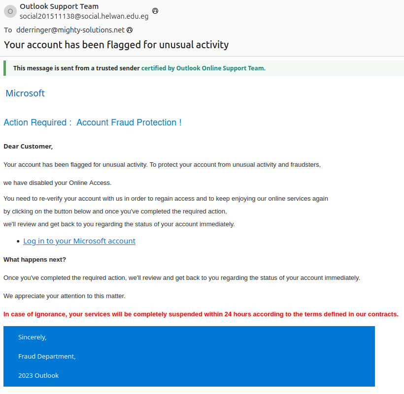
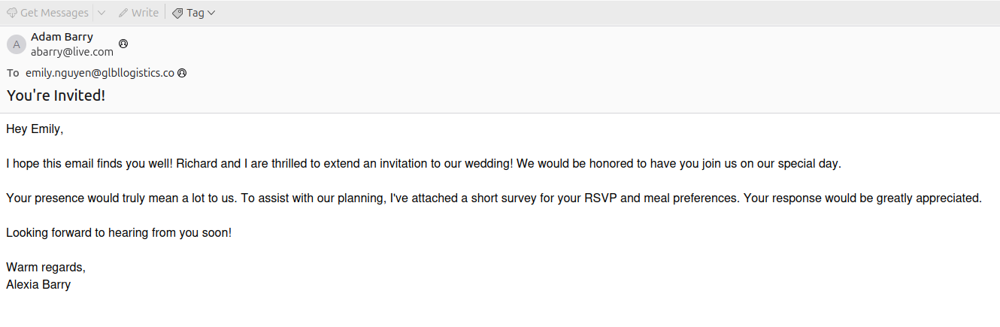

# 🛡️ Phishing & Malware Analysis Project

**Role:** SOC Analyst  
**Organizations Simulated:** Mighty Solutions, Inc. & Global Logistics  
**Project Type:** Email Threat Analysis, Static Malware Analysis, Defensive Action Reporting  
**Tools Used:** CyberChef, VirusTotal, Talos, WHOIS, OLEDump, EMLDump, EIOC, SPF/DKIM/DMARC Analysis

---

## 📁 Overview

This project demonstrates the investigation and remediation of three real-world style phishing and malware cases. Each challenge involved reviewing suspicious emails reported by end users or quarantined by security controls. The project documents the full SOC analysis lifecycle, including header analysis, link/file triage, malware static analysis, and defensive countermeasures.

---

**Role:** SOC Analyst  
**Organizations Simulated:** Mighty Solutions, Inc. & Global Logistics  
**Project Type:** Email Threat Analysis, Static Malware Analysis, Defensive Action Reporting  
**Tools Used:** CyberChef, VirusTotal, Talos, WHOIS, OLEDump, EMLDump, EIOC, SPF/DKIM/DMARC Analysis

---

## 🧪 Challenge 1: Microsoft Impersonation Phishing Attempt

## Description 

You are a SOC Analyst at Mighty Solutions, Inc. An account executive, Dana Derringer, noticed a warning email in her inbox claiming her online access has been disabled. However, she noticed this was odd as she is still able to access her online business platforms and inbox. She decided to forward the email in question to the security team's phishing mailbox for review.

### 📨 Email Details

- **Date:** October 31, 2023  
- **Subject:** "Your account has been flagged for unusual activity"  
- **Sender:** `social201511138@social.helwan.edu.eg`  
- **Sender IP:** `40.107.22.60`  
- **Resolved Host:** `mail-am6eur05on2060.outbound.protection.outlook.com`

### ⚠️ Indicators of Phishing

- Domain mismatch (non-Microsoft `.edu.eg` domain).

- Encoded body (Base64).
- Malicious URL discovered in decoded body.

### 🔗 Malicious URLs

hxxps://raw.githubusercontent[.]com/MalwareCube/SOC101/main/assets/01_Phishing_Analysis/microsoft.jpg
hxxps://0.232.205.92.host.secureserver[.]net/lclbluewin08812/

- Second URL flagged as phishing (VirusTotal).

### 🧾 Verdict

This email is a phishing and spoofing attempt to steal login credentials, impersonating Microsoft.

### 🛡️ Defense Actions

- Blocked sender domain on email gateway.
- Blocked phishing domain `secureserver.net` on EDR and proxy.
- Flagged similar phishing patterns using email filtering.
- Enforced MFA on targeted accounts.

---

## 🔍 Challenge 2: Dropbox Password Reset (Legitimate)

## Description 
You are a SOC Analyst at Global Logistics. Emily Nguyen, a member of the marketing team, recently had trouble signing into her Dropbox account after trying to access it for the first time in months and reached out to her manager for assistance. The next day, she received an email that claims a password change request was made for her Dropbox account. The email includes a link for resetting her password, but Emily is unsure if the request is legitimate. Concerned about potential phishing, she has forwarded the email to the security team for analysis.

### 📨 Email Details

- **Date:** May 12, 2024  
- **Subject:** "Reset your Dropbox password"  
- **Sender:** `no-reply@dropbox.com`  
- **Sender IP:** `54.240.60.143`  
- **Resolved Host:** `a60-143.smtp-out.us-west-2.amazonses.com`

### 🔐 Authentication Results

- SPF, DKIM, and DMARC: ✅ Pass

- WHOIS: AWS/SES IP (legitimate)

### 🔗 URLs Analyzed

hxxps://www.dropbox.com/l/ABCIzswwTTJ9--CxR05fYXX35pPA-Y0m3PY/forgot_finish
hxxps://www.dropbox.com/l/AADQ493u2QLcZrv2kCW6C6i0Ac-mR0hUXxU/help/365

- URLs checked via Talos — favorable results.

### 🧾 Verdict

The email is legitimate. It passed all authentication checks and was confirmed via WHOIS and threat intelligence tools.

### 🛡️ Defense Actions

- Instructed employee to reset password directly from `dropbox.com`.
- Educated user on email hygiene and phishing verification.

---

## 🐛 Challenge 3: Malicious Macro Document (Trojan Delivery)

## Description  
You are a SOC Analyst at Global Logistics. The SOC received an alert about a quarantined email that was flagged by the company's email gateway solution. The email was sent to Emily Nguyen, a member of the marketing team, from her friend Alexia Barry. As the analyst assigned to this ticket, your task is to review the email to determine if the email is safe to release to Emily's inbox or if further action is needed

### 📨 Email Details

- **Date:** May 14, 2024  
- **Subject:** "You're Invited!"  
- **Sender:** `abarry@live.com`  
- **Attachment:** `AR_Wedding_RSVP.docm`

### 🔬 Static Analysis

- File Hashes:
  - MD5: `590d3c98cb5e61ea3e4226639d5623d7`
  - SHA256: `41c3dd4e9f794d53c212398891931760de469321e4c5d04be719d5485ed8f53e`
- VirusTotal flagged the file as a **Trojan**.
- Analyzed with `oledump.py` to reveal embedded VBScript payload.

### 🔗 Malicious Payload URL

URL = "https://github.com/TCWUS/Pastebin-Uploader.exe"
FileName = "shost.exe"
RUNCMD = "shost.exe"ion 

### 📨 Email Details

- **Date:** October 31, 2023  
- **Subject:** "Your account has been flagged for unusual activity"  
- **Sender:** `social201511138@social.helwan.edu.eg`  
- **Sender IP:** `40.107.22.60`  
- **Resolved Host:** `mail-am6eur05on2060.outbound.protection.outlook.com`

### ⚠️ Indicators of Phishing

- Domain mismatch (non-Microsoft `.edu.eg` domain).
- Encoded body (Base64).
- Malicious URL discovered in decoded body.

### 🔗 Malicious URLs

hxxps://raw.githubusercontent[.]com/MalwareCube/SOC101/main/assets/01_Phishing_Analysis/microsoft.jpg
hxxps://0.232.205.92.host.secureserver[.]net/lclbluewin08812/

- Second URL flagged as phishing (VirusTotal).

### 🧾 Verdict

This email is a phishing and spoofing attempt to steal login credentials, impersonating Microsoft.

### 🛡️ Defense Actions

- Blocked sender domain on email gateway.
- Blocked phishing domain `secureserver.net` on EDR and proxy.
- Flagged similar phishing patterns using email filtering.
- Enforced MFA on targeted accounts.

---

